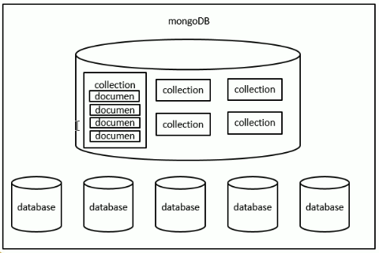

# 1. MongoDB介绍

## 1.1 MongoDB 简介
MongoDB: 文档型数据库
* MongoDB是为快速开发互联网Web应用而设计的数据库系统
* MongoDB设计目标: 极简、灵活、作为web应用栈的一部分
* MongoDB数据模型是面向文档的，所谓文档是一种类似于JSON的结构，简单理解MongoDB这个数据库中存的是各种各样的JSON。(BSON)

## 1.2 MongoDB 三个概念
* 数据库(Database)

数据库是1个仓库，在仓库中可以存放集合。

* 集合(Collection)
  
集合类似于数组，在集合中可存放文档。

* 文档(Document)

文档是数据库中的最小单元，我们存储和操作的内容都是文档。

